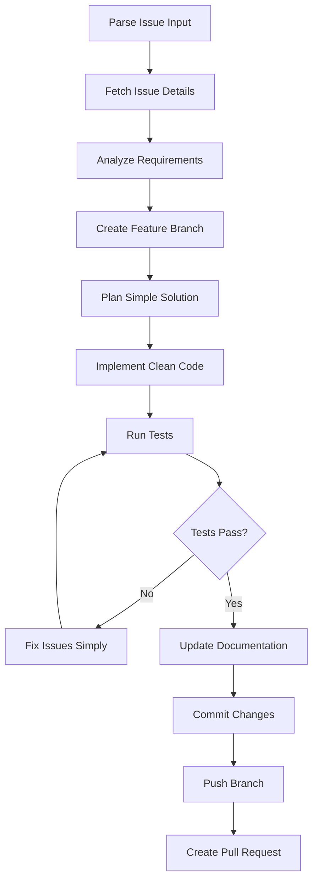

# Analyze GitHub Issue and Implement Solution

Analyze a GitHub issue, create a feature branch, implement the solution, and create a pull request with comprehensive testing and documentation.

## Usage

```
/implement-issue <issue-number-or-url>
```

## Examples

```
/implement-issue 42
/implement-issue https://github.com/gift-calc/gift-calc/issues/15
/implement-issue #23
```

## Implementation Principles

**KISS (Keep It Simple, Stupid) - Core Philosophy:**
- **Simplicity First**: Always choose the simplest solution that solves the problem completely
- **Clean Code**: Write code that is easy to read, understand, and maintain
- **Correctness**: Ensure the solution works reliably and handles edge cases appropriately
- **Minimal Complexity**: Avoid over-engineering; complexity should only be added when absolutely necessary
- **Common Patterns**: Follow established best practices and patterns rather than inventing new approaches
- **Readable Implementation**: Code should be self-documenting with clear variable names and logical structure

## Implementation

### Phase 1: Issue Analysis
1. **Fetch Issue Details**
   - Use `gh issue view $ARGUMENTS` to get comprehensive issue information
   - Parse issue title, body, labels, assignees, and linked PRs
   - Extract acceptance criteria and technical requirements

2. **Codebase Context Analysis**
   - Analyze affected components mentioned in the issue
   - Identify related files and dependencies
   - Review existing tests and documentation that may need updates

### Phase 2: Solution Planning
1. **Branch Creation**
   - Switch to master and ensure it's up-to-date with `git checkout master && git pull origin master`
   - Create descriptive feature branch: `feature/issue-<number>-<brief-description>`
   - Switch to the new branch

2. **Implementation Strategy**
   - Break down the issue into specific, actionable tasks
   - Identify files that need modification or creation
   - Plan test coverage for new functionality
   - Plan documentation updates
   - **Apply KISS Principles**: Choose the most straightforward approach that meets requirements

### Phase 3: Implementation
1. **Code Implementation**
   - **Follow KISS Principles**: Implement the simplest solution that works
   - **Clean & Readable**: Write self-documenting code with clear naming
   - **Minimal Complexity**: Avoid unnecessary abstractions or over-engineering
   - Follow project conventions from CLAUDE.md
   - Maintain existing code style and patterns
   - Ensure all changes align with acceptance criteria

2. **Testing & Validation**
   - Run `npm test` to ensure existing tests pass
   - Add/update tests for new functionality (keep tests simple and focused)
   - Validate implementation against issue requirements

3. **Documentation Updates**
   - Update README.md if CLI interface changes
   - Update related documentation files
   - Ensure help text and examples are current
   - **Keep Documentation Simple**: Clear, concise explanations without unnecessary detail

### Phase 4: Pull Request Creation
1. **Commit and Push Changes**
   - Use `/commit-push` command for conventional commits with semantic versioning
   - Automatically handles staging, committing, and pushing changes

2. **Create PR with Comprehensive Description**
   - Create PR with `gh pr create`
   - Link back to original issue in PR description
   - Include implementation summary and test plan in PR description
   - Add explanation of what was implemented and why directly in PR description
   - Keep PR description concise, correct, and include all relevant technical details

## Arguments

- `$ARGUMENTS`: GitHub issue number (e.g., `42`, `#42`) or full issue URL

## Command Flow



## Error Handling

- **Invalid Issue**: If issue doesn't exist or isn't accessible, provide clear error message
- **Permission Issues**: Guide user to check GitHub authentication with `gh auth status`
- **Branch Conflicts**: Handle cases where feature branch already exists
- **Test Failures**: Stop implementation and report specific failures for manual review

## Integration Notes

- **Follows Project Patterns**: Uses same structure as existing `/commit` and `/feature` commands
- **GitHub CLI Integration**: Leverages `gh` commands as specified in CLAUDE.md
- **Conventional Commits**: Maintains professional commit standards without AI attribution
- **Semantic Versioning**: Uses appropriate commit types (`feat:`, `fix:`, etc.) for automated versioning

## Best Practices Applied

1. **KISS Principles**: Always choose simplicity over complexity
2. **Clean Code Standards**: Readable, maintainable, and well-structured implementations
3. **Common Patterns**: Follow established conventions and best practices
4. **Minimal Complexity**: Add complexity only when absolutely necessary
5. **Comprehensive Analysis**: Deep understanding before implementation
6. **Methodical Approach**: Step-by-step workflow with validation points  
7. **Quality Assurance**: Mandatory testing and documentation updates
8. **Professional Standards**: Clean commits and PR descriptions
9. **Traceability**: Clear links between issue, implementation, and PR
10. **Error Recovery**: Graceful handling of common failure scenarios

## Success Metrics

- Issue requirements fully addressed with the simplest possible solution
- Code is clean, readable, and follows KISS principles
- All tests passing with straightforward test implementations
- Documentation updated appropriately with clear, concise explanations
- Clean commit history with proper references
- PR ready for review with clear description
- No unnecessary complexity or over-engineering
- Solution is maintainable and easy to understand

This command transforms GitHub issue management from a manual, error-prone process into a systematic, repeatable workflow that ensures quality, simplicity, and completeness.